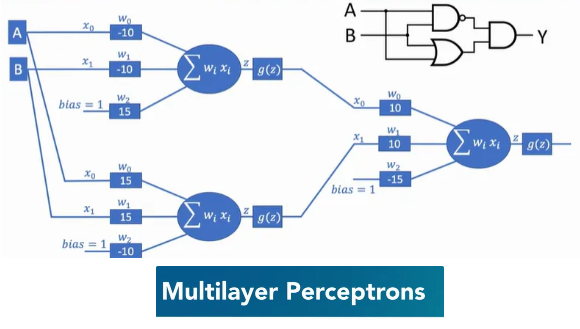
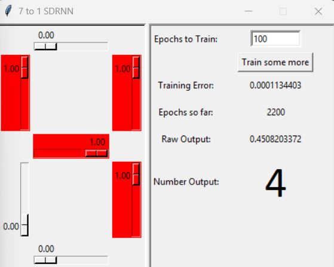
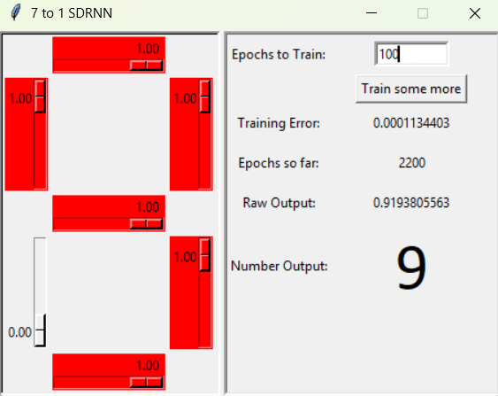
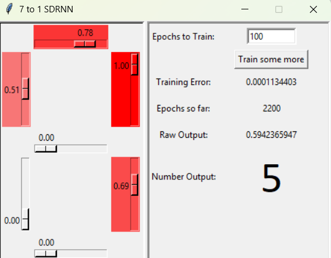

# Neural Networks Implementation (Perceptron to MLP)

I build and train neural networks from scratch, and design multilayer perceptrons.

---

## 🚀 Learning Objectives

- Understand the core differences between neural networks and traditional programming tools.
- Evaluate when to apply neural networks for machine learning tasks.
- Design multilayer perceptrons using key parameters (inputs, outputs, layers).
- Build and train perceptron models as the foundation of neural networks.

- Finally I have made a GUI application to implement MLP neural network that will make a Segment Display Recognition(SDR) and play with different controls. 
---

